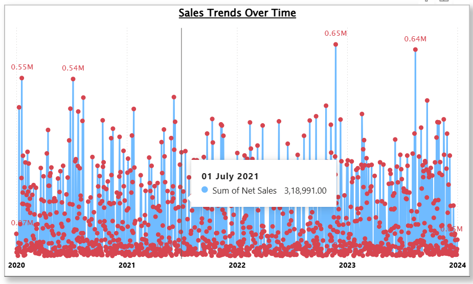

# Power BI Sales Data Analysis Dashboard

**Author:** Megha Kallapur  
**Location:** Karnataka, India  
**GitHub:** https://github.com/Megha-B-K  

---

## Project Overview

Interactive **Power BI dashboard** analyzing **3,509 sales orders** to generate business insights across products, promotions, geography, and time-series trends. The dashboard helps identify revenue drivers and supports data-driven decision-making.

**Dataset:** 50K+ sales records including Product Name, Promotion Name, City (India-focused), Sales, Profit, Quantity, and Discount %.

**Business Goal:** Identify top-performing products, effective promotions, geographic sales hotspots, and peak sales periods.

---

## Dashboard Preview

### Top / Bottom Products


### Sales Trend


### Geographic Sales Map
### Profit vs Sales vs Quantity

---

## Dashboard Features

| Visual Type | Analysis | Insight |
|-------------|----------|--------|
| Card | Total Orders | 3,509 orders |
| Bar Chart | Top/Bottom 5 Products | Apple iPhone & Apple TV dominate sales |
| Scatter Plot | Sales vs Profit | Strong positive correlation |
| Horizontal Bar | Discount by Promotion | Promotion 1 has ~28% avg discount |
| Line Chart | Sales Trends | Peak sales during 2022–2023 |
| Map | Sales by City | Karnataka & Maharashtra clusters |
| KPI Cards | Sales / Profit / Quantity | Business performance metrics |

---

## Technical Implementation

### Data Model

Fact Table: **Sales**

Columns:
- Order ID
- Product Name
- Promotion Name
- City
- Sales (₹)
- Profit (₹)
- Quantity
- Discount %

Relationships: **1:M relationships using Order ID**

---

## Key DAX Measures

```dax
Profit Margin =
DIVIDE([Total Profit], [Total Sales], 0)

YoY Sales Growth =
DIVIDE(
    [Total Sales] - CALCULATE([Total Sales], SAMEPERIODLASTYEAR('Date'[Date])),
    CALCULATE([Total Sales], SAMEPERIODLASTYEAR('Date'[Date]))
)

Top N Sales =
TOPN(5, 'Sales', [Total Sales], DESC)

Avg Discount by Promotion =
AVERAGEX(
    VALUES('Sales'[Promotion Name]),
    CALCULATE(AVERAGE('Sales'[Discount %]))
)
```

---

## Business Insights

- **Product Performance:** Apple iPhone & Apple TV generate majority of revenue and profit

- **Promotion Effectiveness:** Promotion 1 provides the highest discount impact (~28%)

- **Profit Correlation:** Strong relationship between sales and profit

- **Geographic Trends:** Karnataka and Maharashtra cities show high sales activity

- **Seasonal Trends:** Peak sales observed during 2022–2023

---

## Skills Demonstrated

- Power BI Dashboard Development
- DAX Measures and Calculations
- Data Modeling and Relationships
- Geographic Visualization (Maps)
- Business Intelligence and KPI Reporting

---

## Files in Repository

- **Sales Data Analysis.pbix** → Power BI dashboard
- **Store Data.xlsx** → Dataset
- **Power BI Project 1 Requirements.pptx** → Project requirements

---

## Contact

Email: **meghakallapur22@gmail.com**

GitHub: **https://github.com/Megha-B-K**
